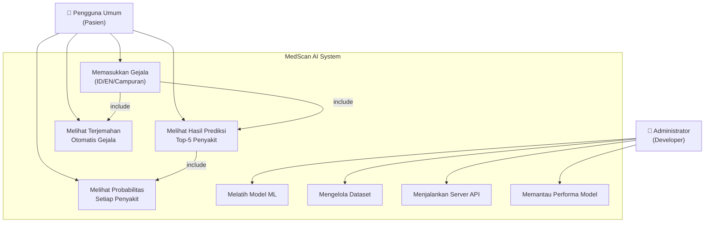
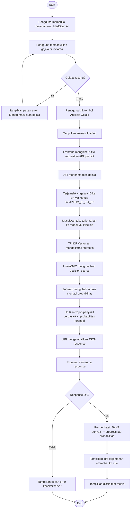
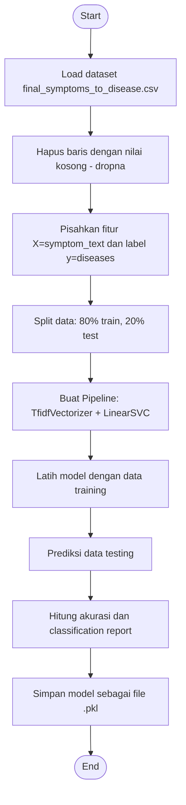
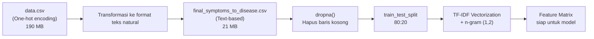
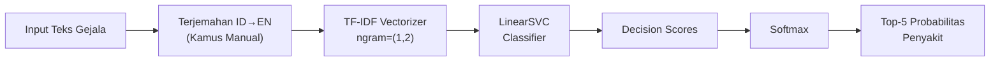
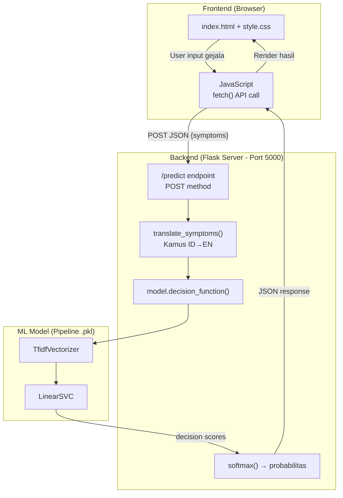

# LAPORAN FINAL PROJECT
## Terapan Kecerdasan dan Teknologi Informasi (TKTI)

---

### **MedScan AI — Intelligent Disease Predictor**
### Sistem Prediksi Penyakit Berbasis Natural Language Processing (NLP)

---

**Anggota Kelompok:**
| No | Nama | NIM | Peran |
|----|------|-----|-------|
| 1 | *(Nama Anggota 1)* | *(NIM)* | Project Lead / ML Engineer |
| 2 | *(Nama Anggota 2)* | *(NIM)* | Backend Developer |
| 3 | *(Nama Anggota 3)* | *(NIM)* | Frontend Developer |

> [!IMPORTANT]
> Silakan isi data identitas kelompok di atas sesuai anggota kelompok Anda.

**Program Studi:** *(Nama Program Studi)*
**Dosen Pengampu:** *(Nama Dosen)*
**Tahun Akademik:** 2025/2026

---

## 1. Deskripsi Project

### 1.1 Latar Belakang Masalah

Kesehatan merupakan aspek fundamental dalam kehidupan manusia. Seringkali, masyarakat mengalami gejala-gejala tertentu namun kesulitan untuk menentukan kemungkinan penyakit yang diderita sebelum berkonsultasi dengan tenaga medis profesional. Keterbatasan akses terhadap fasilitas kesehatan, terutama di daerah terpencil, serta minimnya pengetahuan medis masyarakat umum menjadi hambatan dalam deteksi dini penyakit.

Di sisi lain, perkembangan teknologi kecerdasan buatan (Artificial Intelligence), khususnya di bidang Natural Language Processing (NLP), memungkinkan pengembangan sistem yang mampu memahami dan memproses teks bahasa alami. Dengan memanfaatkan dataset medis yang berisi korelasi antara gejala dan penyakit, dapat dibangun sebuah model prediktif yang membantu pengguna mendapatkan informasi awal mengenai kemungkinan penyakit berdasarkan gejala yang dirasakan.

### 1.2 Tujuan

1. Mengembangkan model Machine Learning berbasis NLP yang mampu memprediksi penyakit berdasarkan deskripsi gejala dalam bentuk teks.
2. Membangun REST API menggunakan Flask sebagai backend yang menyediakan endpoint prediksi penyakit.
3. Mengembangkan antarmuka web modern dan responsif untuk interaksi pengguna dengan sistem.
4. Mendukung input gejala dalam **Bahasa Indonesia**, **Bahasa Inggris**, maupun **campuran keduanya** melalui fitur terjemahan otomatis.
5. Menampilkan **Top-5 prediksi penyakit** beserta tingkat probabilitasnya.

### 1.3 Manfaat

1. **Bagi Masyarakat:** Memberikan informasi awal mengenai kemungkinan penyakit berdasarkan gejala yang dialami, sehingga dapat menjadi acuan sebelum berkonsultasi ke dokter.
2. **Bagi Akademisi:** Menjadi referensi penerapan NLP dan Machine Learning di bidang kesehatan.
3. **Bagi Pengembang:** Mendemonstrasikan arsitektur full-stack aplikasi berbasis AI, mulai dari training model hingga deployment web.

### 1.4 Kebutuhan Sistem

| Kategori | Kebutuhan |
|----------|-----------|
| **Hardware** | Komputer/laptop dengan RAM minimal 8 GB, prosesor multi-core |
| **OS** | Windows 10/11, Linux, atau macOS |
| **Python** | Python 3.10+ |
| **Library ML** | scikit-learn, pandas, numpy, joblib |
| **Backend** | Flask, Flask-CORS |
| **Frontend** | HTML5, CSS3, JavaScript (Vanilla) |
| **Browser** | Google Chrome, Mozilla Firefox, atau Edge (terbaru) |
| **Opsional** | Streamlit (untuk alternatif antarmuka), Jupyter Notebook |

---

## 2. Users (Aktor)

### 2.1 Daftar Pengguna

| No | Aktor | Deskripsi |
|----|-------|-----------|
| 1 | **Pengguna Umum (Pasien)** | Individu yang ingin mengetahui kemungkinan penyakit berdasarkan gejala yang dirasakan. Pengguna memasukkan gejala melalui antarmuka web dan menerima hasil prediksi Top-5 penyakit beserta probabilitasnya. |
| 2 | **Administrator / Developer** | Bertanggung jawab mengelola sistem, melatih ulang model ML, memperbarui dataset, serta melakukan maintenance pada server API. |

### 2.2 Diagram Use Case



---

## 3. Workflow

### 3.1 Alur Penggunaan Sistem

Berikut adalah diagram aktivitas yang menunjukkan alur interaksi antara pengguna dan sistem:

### 3.2 Diagram Aktivitas — Proses Prediksi Penyakit



### 3.3 Diagram Aktivitas — Proses Training Model



---

## 4. Sumber Data, Jumlah Data, Contoh Data, dan Cara Pengolahan

### 4.1 Sumber Data

Dataset yang digunakan berasal dari kumpulan data medis berupa pemetaan gejala-penyakit. Terdapat dua file dataset:

| File | Ukuran | Deskripsi |
|------|--------|-----------|
| `data.csv` | ~190 MB | Dataset mentah dengan kolom biner per gejala (one-hot encoding) |
| `final_symptoms_to_disease.csv` | ~21 MB | Dataset olahan dengan gejala dalam bentuk teks natural |

### 4.2 Jumlah Data

| Metrik | Nilai |
|--------|-------|
| **Total record** | 192.715 baris |
| **Jumlah penyakit unik** | 254 jenis penyakit |
| **Data latih (80%)** | 154.172 baris |
| **Data uji (20%)** | 38.543 baris |

### 4.3 Struktur dan Contoh Data

Dataset `final_symptoms_to_disease.csv` memiliki **2 kolom**:

| Kolom | Tipe | Deskripsi |
|-------|------|-----------|
| `diseases` | string | Label/nama penyakit |
| `symptom_text` | string | Daftar gejala dalam bentuk teks, dipisahkan koma |

**Contoh Data:**

| diseases | symptom_text |
|----------|-------------|
| panic disorder | anxiety and nervousness, shortness of breath, depressive or psychotic symptoms, chest tightness, palpitations |
| panic disorder | shortness of breath, depressive or psychotic symptoms, dizziness, insomnia, palpitations |
| panic disorder | anxiety and nervousness, depression, shortness of breath, depressive or psychotic symptoms, dizziness |

### 4.4 Cara Pengolahan Data



**Langkah-langkah pengolahan:**

1. **Data Cleaning:** Menghapus baris yang memiliki nilai kosong (`NaN`) pada kolom `diseases` atau `symptom_text`.
2. **Text Preprocessing:** Dataset sudah dalam format teks lowercase yang terstruktur.
3. **Train-Test Split:** Membagi data menjadi 80% data latih dan 20% data uji dengan `random_state=42` untuk reproduksibilitas.
4. **Feature Extraction (TF-IDF):** Mengubah teks gejala menjadi representasi numerik menggunakan TF-IDF Vectorizer dengan parameter:
   - `stop_words='english'` — menghapus kata umum bahasa Inggris
   - `ngram_range=(1, 2)` — menangkap unigram dan bigram
   - `max_df=0.95` — mengabaikan kata yang muncul di >95% dokumen

---

## 5. Metode dan Algoritma

### 5.1 Pemilihan Metode

Sistem ini menggunakan pendekatan **Supervised Learning** dengan pipeline NLP yang terdiri dari:

#### A. TF-IDF Vectorizer (Feature Extraction)

**Term Frequency–Inverse Document Frequency (TF-IDF)** dipilih karena:
- Efektif mengubah teks menjadi representasi numerik yang bermakna.
- Memberikan bobot lebih tinggi pada kata-kata yang relevan dan spesifik untuk dokumen tertentu.
- Mendukung n-gram sehingga dapat menangkap frasa gejala multi-kata (misal: "shortness of breath").

**Formula TF-IDF:**
```
TF-IDF(t, d) = TF(t, d) × IDF(t)
TF(t, d) = frekuensi term t dalam dokumen d
IDF(t) = log(N / df(t))
  N   = jumlah total dokumen
  df  = jumlah dokumen yang mengandung term t
```

#### B. LinearSVC (Classifier)

**Linear Support Vector Classification** dipilih karena:
- Sangat efisien untuk klasifikasi teks berdimensi tinggi.
- Performa tinggi pada dataset besar (192.715 data) dibandingkan SVC dengan kernel non-linear.
- Mendukung klasifikasi multi-kelas secara native (one-vs-rest).
- Mampu menangani 254 kelas penyakit dengan baik.

#### C. Softmax (Post-processing Probabilitas)

Karena `LinearSVC` tidak menghasilkan probabilitas secara default, digunakan fungsi **Softmax** untuk mengubah decision scores menjadi distribusi probabilitas:

```
P(class_i) = exp(score_i) / Σ exp(score_j)
```

#### D. Kamus Terjemahan Gejala (ID → EN)

Untuk mendukung input Bahasa Indonesia, dibangun kamus terjemahan manual dengan **200+ pasangan gejala** yang mencakup kategori:
- Gejala umum (demam, pusing, lemas, dll.)
- Pernapasan (batuk, sesak napas, dll.)
- Pencernaan (mual, diare, sakit perut, dll.)
- Jantung & pembuluh darah
- Kulit, Otot & sendi
- Saluran kemih, Mata, Telinga
- Mental & saraf

### 5.2 Arsitektur Pipeline Model



---

## 6. Implementasi

### 6.1 Tools dan Teknologi

| Komponen | Teknologi | Versi |
|----------|-----------|-------|
| **Bahasa Pemrograman** | Python | 3.12+ |
| **ML Framework** | scikit-learn | latest |
| **Data Processing** | pandas, numpy | latest |
| **Model Serialization** | joblib | latest |
| **Backend API** | Flask, Flask-CORS | latest |
| **Frontend** | HTML5, CSS3, JavaScript | - |
| **UI Design** | Glassmorphism, Inter Font | - |
| **Icon Library** | Font Awesome | 6.4.0 |
| **Alternatif UI** | Streamlit | latest |
| **IDE/Notebook** | Jupyter Notebook, VS Code | - |

### 6.2 Struktur File Project

```
Project TKTI/
├── NLP-Predict Diseases.ipynb   # Notebook eksplorasi & training model
├── train_nlp_model.py           # Script training model (standalone)
├── api.py                       # Flask REST API server
├── app.py                       # Alternatif UI menggunakan Streamlit
├── index.html                   # Halaman web utama (frontend)
├── style.css                    # Stylesheet (glassmorphism design)
├── data.csv                     # Dataset mentah (~190 MB)
├── final_symptoms_to_disease.csv # Dataset olahan (~21 MB)
└── symptoms_disease_nlp_model.pkl # Model ML yang sudah dilatih (~6.8 MB)
```

### 6.3 Cara Kerja Sistem Secara Keseluruhan



**Alur kerja detail:**

1. **Pengguna** mengakses `http://127.0.0.1:5000` di browser.
2. Flask melayani file `index.html` melalui route `/`.
3. Pengguna mengetikkan gejala (dalam Bahasa Indonesia, Inggris, atau campuran).
4. Saat tombol **"Analisis Gejala"** diklik, JavaScript mengirim `POST` request ke endpoint `/predict`.
5. Server API:
   - Menerima teks gejala dari JSON body.
   - Menerjemahkan gejala Bahasa Indonesia ke Bahasa Inggris menggunakan kamus `SYMPTOM_ID_TO_EN`.
   - Memasukkan teks terjemahan ke model pipeline (TF-IDF → LinearSVC).
   - Mengubah decision scores menjadi probabilitas via Softmax.
   - Mengurutkan dan mengambil Top-5 penyakit dengan probabilitas tertinggi.
6. Response JSON dikirim kembali ke frontend.
7. Frontend merender hasil berupa kartu prediksi dengan progress bar berwarna dan informasi terjemahan otomatis.

---

## 7. Pengujian dan Evaluasi

### 7.1 Evaluasi Model

Model dievaluasi pada **38.543 data uji** (20% dari total dataset).

| Metrik | Nilai |
|--------|-------|
| **Akurasi Keseluruhan** | **86.32%** |
| **Macro Average Precision** | 0.87 |
| **Macro Average Recall** | 0.87 |
| **Macro Average F1-Score** | 0.87 |
| **Weighted Average Precision** | 0.87 |
| **Weighted Average Recall** | 0.86 |
| **Weighted Average F1-Score** | 0.86 |

### 7.2 Performa Per Kategori Penyakit (Sampel)

| Penyakit | Precision | Recall | F1-Score | Support |
|----------|-----------|--------|----------|---------|
| Concussion | 1.00 | 1.00 | 1.00 | 240 |
| Obstructive Sleep Apnea | 0.99 | 1.00 | 0.99 | 243 |
| Iron Deficiency Anemia | 0.99 | 0.99 | 0.99 | 135 |
| Breast Infection (Mastitis) | 0.99 | 0.99 | 0.99 | 88 |
| Smoking or Tobacco Addiction | 0.99 | 0.99 | 0.99 | 176 |
| Thrombophlebitis | 1.00 | 0.99 | 0.99 | 73 |
| Hypoglycemia | 0.97 | 0.97 | 0.97 | 257 |
| Anxiety | 0.94 | 0.92 | 0.93 | 241 |
| Common Cold | 0.88 | 0.87 | 0.88 | 191 |
| Pneumonia | 0.86 | 0.71 | 0.78 | 252 |

### 7.3 Contoh Pengujian Prediksi

| Input Gejala | Prediksi Model |
|-------------|----------------|
| shortness of breath, depressive or psychotic symptoms, dizziness | Panic Disorder |
| frequent urination, extreme hunger, increased thirst | Erectile Dysfunction* |
| throat pain, fever, cough, headache | *(Strep Throat / Common Cold)* |

> [!NOTE]
> *Beberapa prediksi mungkin kurang akurat karena kemiripan gejala antar penyakit. Ini menunjukkan pentingnya disclaimer bahwa hasil prediksi hanya untuk tujuan edukasi.

### 7.4 Pengujian Fitur Terjemahan

| Input (Bahasa Indonesia) | Terjemahan Otomatis (Bahasa Inggris) |
|--------------------------|--------------------------------------|
| sakit kepala | headache |
| demam, batuk, sesak napas | fever, cough, shortness of breath |
| mual, nyeri perut, diare | nausea, abdominal pain, diarrhea |
| pusing, jantung berdebar, cemas | dizziness, palpitations, anxiety |

### 7.5 Pengujian Fungsional Web

| Fitur | Status | Keterangan |
|-------|--------|------------|
| Input gejala (textarea) | ✅ Pass | Mendukung multi-baris dan placeholder informatif |
| Validasi input kosong | ✅ Pass | Menampilkan pesan error yang sesuai |
| Animasi loading | ✅ Pass | Pulse loader dengan animated dots |
| Koneksi API | ✅ Pass | POST ke `http://127.0.0.1:5000/predict` |
| Render Top-5 prediksi | ✅ Pass | Progress bar berwarna dengan animasi |
| Terjemahan otomatis | ✅ Pass | Chip terjemahan ditampilkan di UI |
| Responsivitas mobile | ✅ Pass | Layout menyesuaikan di viewport ≤480px |
| Error handling server mati | ✅ Pass | Pesan "Koneksi gagal" ditampilkan |
| Disclaimer medis | ✅ Pass | Selalu ditampilkan di bawah hasil |

---

## 8. Kesimpulan

### 8.1 Ringkasan

Project **MedScan AI** berhasil mengembangkan sistem prediksi penyakit berbasis NLP Machine Learning dengan fitur-fitur utama:

1. **Model ML** menggunakan pipeline TF-IDF + LinearSVC yang dilatih pada **192.715 data** mencakup **254 jenis penyakit**, mencapai **akurasi 86,32%**.
2. **REST API** berbasis Flask yang menyediakan endpoint prediksi penyakit dengan response berupa Top-5 penyakit dan probabilitasnya.
3. **Antarmuka web modern** dengan desain glassmorphism, animasi dinamis, dan user experience yang premium.
4. **Fitur bilingual** mendukung input gejala dalam Bahasa Indonesia, Inggris, maupun campuran melalui kamus terjemahan otomatis (200+ gejala).

### 8.2 Kelebihan Sistem

- Akurasi model yang cukup baik (86,32%) untuk klasifikasi 254 kelas.
- Mendukung input multibahasa (ID/EN/campuran).
- Antarmuka yang intuitif dan modern.
- Arsitektur modular (model, API, dan frontend terpisah).
- Waktu prediksi yang cepat (real-time).

### 8.3 Keterbatasan

- Model hanya mampu memprediksi 254 penyakit yang ada dalam dataset.
- Kamus terjemahan bersifat manual dan belum mencakup seluruh gejala medis.
- Beberapa penyakit dengan gejala mirip masih sulit dibedakan oleh model.
- Sistem tidak menggantikan diagnosis dokter profesional.

### 8.4 Saran Pengembangan

1. Memperbesar dan memperbarui dataset dengan data medis terkini.
2. Mengimplementasikan model deep learning (BERT, BioBERT) untuk akurasi lebih tinggi.
3. Mengintegrasikan API terjemahan otomatis (Google Translate) untuk mendukung lebih banyak bahasa.
4. Menambahkan fitur riwayat pencarian dan rekomendasi tindakan medis.
5. Melakukan deployment ke cloud (Heroku, AWS, atau GCP) agar dapat diakses publik.

---

> [!WARNING]
> **Disclaimer:** Hasil prediksi dari sistem MedScan AI hanya untuk tujuan **edukasi**. Selalu konsultasikan dengan dokter profesional untuk diagnosis yang akurat.

---

*Dokumen ini dibuat sebagai laporan final project mata kuliah Terapan Kecerdasan dan Teknologi Informasi (TKTI).*
